# Dependency Graph — Phase 2 Cleanup Audit

**Project:** Rydez India  
**Date:** 2026-06-17  
**Scope:** All files marked **Safe to Delete** or **Review Before Delete** in `PHASE1_OPTIMIZATION_AUDIT.md`  
**Method:** Static import analysis, dynamic import scan, route/API/middleware reference grep across entire codebase (excluding `server/node_modules`).

---

## Legend

| Symbol | Meaning |
|--------|---------|
| ✅ | Zero references — passes deletion gate |
| ⚠️ | References found — requires review |
| 🔴 | Active dependency — do not delete |
| → | Depends on / referenced by |

---

## Part A — Safe to Delete Candidates (Phase 1)

### A1. `components/forms/MarketplaceBookingForm.tsx`

```
MarketplaceBookingForm.tsx
  imports → @/lib/utils (formatINR)
  imports → @/components/ui/Button
  imports → types from @/types/database
  imported by → (none)
```

| Check | Result |
|-------|--------|
| Static imports | ✅ 0 inbound |
| Dynamic imports | ✅ 0 |
| Route references | ✅ 0 |
| API references | ✅ 0 |
| Middleware references | ✅ 0 |

**Verdict:** ✅ **SAFE_DELETE_FINAL**

---

### A2. `server/actions/kyc.ts`

```
server/actions/kyc.ts
  imports → @/server/actions/ownerKyc (submitOwnerProfileKyc)
  exports → submitOwnerKyc (deprecated wrapper)
  imported by → (none)
```

| Check | Result |
|-------|--------|
| Static imports | ✅ 0 inbound |
| Dynamic imports | ✅ 0 |
| Route references | ✅ 0 (revalidatePath targets /owner/dashboard, not this file) |
| API references | ✅ 0 |
| Middleware references | ✅ 0 |

**Verdict:** ✅ **SAFE_DELETE_FINAL**

---

### A3. Legacy Express/MongoDB Server (NOT `server/actions/`)

> **Correction:** Phase 1 listed entire `server/` folder. **`server/actions/` is active Next.js server code and must not be deleted.** Only the legacy Express subset below was audited.

```
server/index.js
  requires → ./routes/auth, vehicles, bookings, owners, admin
  requires → mongoose, express, cors, dotenv
  imported by → (none from Next.js app)

server/routes/auth.js ──→ ../middleware/auth, ../models/User
server/routes/admin.js ──→ ../middleware/auth
server/routes/bookings.js ──→ ../middleware/auth, ../models/Booking
server/routes/owners.js ──→ ../middleware/auth
server/routes/vehicles.js ──→ ../middleware/auth, ../models/Vehicle

server/models/User.js ──→ mongoose
server/models/Booking.js ──→ mongoose
server/models/Vehicle.js ──→ mongoose

server/middleware/auth.js ──→ jsonwebtoken, bcryptjs

server/package.json ──→ standalone Express app (port 5000)
server/node_modules/ ──→ ~13 MB nested install (express, mongoose, etc.)
```

| File / Path | Inbound from Next.js | Route/API/Middleware Refs |
|-------------|---------------------|---------------------------|
| `server/index.js` | ✅ 0 | ✅ 0 (legacy `/api/*` on port 5000, unused by app) |
| `server/routes/*.js` (5 files) | ✅ 0 | ✅ 0 |
| `server/models/*.js` (3 files) | ✅ 0 | ✅ 0 |
| `server/middleware/auth.js` | ✅ 0 | ✅ 0 (legacy Express only) |
| `server/package.json` | ✅ 0 | ✅ 0 |
| `server/package-lock.json` | ✅ 0 | ✅ 0 |
| `server/.env.example` | ✅ 0 | ✅ 0 |
| `server/node_modules/` | ✅ 0 | ✅ 0 |

**Note:** Next.js app uses `app/api/auth/*` (Supabase OTP), not `server/routes/auth.js`.

**Verdict:** ✅ **SAFE_DELETE_FINAL** (legacy Express subset only)

---

### A4. `app/admin/kyc/page.tsx`

```
app/admin/kyc/page.tsx
  exports → LegacyAdminKycRedirect
  action → redirect("/admin/owner-management")
```

| Check | Result |
|-------|--------|
| Static imports | ✅ 0 inbound |
| Dynamic imports | ✅ 0 |
| Route references | ⚠️ **6** — `revalidatePath("/admin/kyc")` in `ownerKyc.ts`, `marketplaceAdmin.ts`, `phase2Admin.ts`; listed in `adminManagement.ts` ADMIN_PATHS; documented in `admin-modules.ts` LEGACY_ADMIN_REDIRECTS |
| API references | ✅ 0 |
| Middleware references | ✅ 0 (proxy.ts does not redirect this path) |

**Verdict:** ⚠️ **REVIEW_REQUIRED** — Route is live; cache invalidation paths depend on URL existing.

---

### A5. `app/admin/owners/page.tsx`

```
app/admin/owners/page.tsx → redirect("/admin/owner-management")
```

| Check | Result |
|-------|--------|
| Route references | ⚠️ **4** — `revalidatePath("/admin/owners")` in `marketplaceAdmin.ts`, `phase2Admin.ts`; ADMIN_PATHS; LEGACY_ADMIN_REDIRECTS |

**Verdict:** ⚠️ **REVIEW_REQUIRED**

---

### A6. `app/admin/customer-kyc/page.tsx`

```
app/admin/customer-kyc/page.tsx → redirect("/admin/customer-management")
```

| Check | Result |
|-------|--------|
| Route references | ⚠️ **5** — `revalidatePath("/admin/customer-kyc")` in `phase2Admin.ts`; ADMIN_PATHS; LEGACY_ADMIN_REDIRECTS |

**Verdict:** ⚠️ **REVIEW_REQUIRED**

---

### A7. `app/user/login/page.tsx`

```
app/user/login/page.tsx → redirect("/login/rider")
```

| Check | Result |
|-------|--------|
| Static imports | ✅ 0 inbound |
| Route references | ⚠️ **3** — `proxy.ts` lines 88, 128 (legacy redirect + riderPublic); `sitemap.ts` does not list this path |
| Middleware references | ⚠️ **2** — `proxy.ts` handles `/user/login` |

**Verdict:** ⚠️ **REVIEW_REQUIRED** — Can delete page **only if** redirect remains in `proxy.ts` or `next.config.ts`.

---

### A8. `app/user/register/page.tsx`

```
app/user/register/page.tsx → redirect("/signup/rider")
```

| Check | Result |
|-------|--------|
| Route references | ⚠️ **4** — `proxy.ts` lines 89, 129; `sitemap.ts` line 22; `README.md` line 47 |
| Middleware references | ⚠️ **2** — `proxy.ts` |

**Verdict:** ⚠️ **REVIEW_REQUIRED**

---

## Part B — Review Before Delete Candidates (Phase 1)

### B1. `app/dashboard/page.tsx`

```
app/dashboard/page.tsx
  re-exports → @/app/user/dashboard/page
```

| Check | Result |
|-------|--------|
| Route references | 🔴 **15+** — Canonical `/dashboard` URL; `proxy.ts` riderOnly; `HeaderClient.tsx`; `lib/auth/roles.ts`; multiple `revalidatePath("/dashboard")` calls |

**Verdict:** 🔴 **DO_NOT_DELETE**

---

### B2. `app/user/profile/kyc/page.tsx`

```
app/user/profile/kyc/page.tsx
  imports → RiderKycUploadForm, customerKyc actions, UserDashboardNav
  duplicate of → app/dashboard/kyc/page.tsx (minus searchParams banner)
```

| Check | Result |
|-------|--------|
| Route references | 🔴 **5** — `UserDashboardNav.tsx`; `customerKyc.ts` revalidatePath; `proxy.ts` `/user/profile` prefix |

**Verdict:** ⚠️ **REVIEW_REQUIRED** — Merge into `/dashboard/kyc` before delete.

---

### B3. `app/user/dashboard/verification/page.tsx`

```
app/user/dashboard/verification/page.tsx
  imports → RiderKycUploadForm, customerKyc, UserDashboardNav
  overlaps → app/dashboard/kyc/page.tsx
```

| Check | Result |
|-------|--------|
| Route references | 🔴 **4** — `UserDashboardNav.tsx` nav link; `customerKyc.ts` revalidatePath; `proxy.ts` explicit path |

**Verdict:** ⚠️ **REVIEW_REQUIRED** — Active nav item; merge with KYC page first.

---

### B4. Duplicate Legal Pages

| Path | Canonical Alternative | Inbound Route Refs |
|------|----------------------|-------------------|
| `app/privacy/page.tsx` | `/privacy-policy` | ⚠️ 1 — metadata path only; Footer uses `/privacy-policy` |
| `app/contact/page.tsx` + `layout.tsx` | `/contact-us` | ⚠️ 2 — `HeaderClient.tsx` `/contact`; `investors/page.tsx` `/contact` |
| `app/terms/page.tsx` | `/terms-and-conditions` | ⚠️ 1 — metadata path only |
| `app/refund/page.tsx` | `/refund-policy` | ⚠️ 1 — metadata path only |

**Verdict:** ⚠️ **REVIEW_REQUIRED** — Add 301 redirects and update Header/investors links before delete.

---

### B5. `app/login/page.tsx`

```
app/login/page.tsx
  imports → AuthRolePicker
  serves → /login role selection
```

| Check | Result |
|-------|--------|
| Route references | ⚠️ **2** — `proxy.ts` authSelectionPaths includes `/login`; metadata path |

**Verdict:** ⚠️ **REVIEW_REQUIRED** — Role picker still functional; low traffic risk if removed.

---

### B6. `components/vehicles/SearchResultCard.tsx`

```
SearchResultCard.tsx
  imported by → app/search/page.tsx
              → components/search/SearchPageClient.tsx
```

| Check | Result |
|-------|--------|
| Static imports | 🔴 **2 inbound** |
| Route references | 🔴 `/search` actively linked from 10+ pages |

**Verdict:** 🔴 **DO_NOT_DELETE**

---

### B7. `components/vehicles/MarketplaceResultCard.tsx`

```
MarketplaceResultCard.tsx
  imported by → app/search/page.tsx
```

| Check | Result |
|-------|--------|
| Static imports | 🔴 **1 inbound** |
| Route references | 🔴 `/search` page uses for with_driver + self_drive results |

**Verdict:** 🔴 **DO_NOT_DELETE**

---

### B8. `supabase/RUN_*.sql` (15 files)

| Check | Result |
|-------|--------|
| Code imports | ✅ 0 (manual SQL Editor scripts) |
| Operational refs | ⚠️ Documented in audit reports and runbooks |

**Verdict:** ⚠️ **REVIEW_REQUIRED** — Keep as runbooks; consolidate per `MIGRATION_CONSOLIDATION_REPORT.md`.

---

### B9. `supabase/migrations/001–006`

| Check | Result |
|-------|--------|
| Code imports | ✅ 0 |
| Schema dependency | 🔴 Foundation for 007+ if already applied in production |

**Verdict:** 🔴 **DO_NOT_DELETE** — Historical migration chain; never remove applied migrations.

---

## Part C — Aggregate Dependency Graph (Safe Delete Cluster)

```mermaid
flowchart TD
  subgraph SAFE["SAFE_DELETE_FINAL — zero inbound refs"]
    MBF[MarketplaceBookingForm.tsx]
    KYC[server/actions/kyc.ts]
    LEG[Legacy Express server<br/>index.js routes models middleware]
  end

  subgraph REVIEW["REVIEW_REQUIRED — route/middleware refs"]
    AK[admin/kyc/page.tsx]
    AO[admin/owners/page.tsx]
    AC[admin/customer-kyc/page.tsx]
    UL[user/login/page.tsx]
    UR[user/register/page.tsx]
    LEGAL[privacy contact terms refund pages]
    LOGIN[login/page.tsx]
    KYC_ALIAS[profile/kyc + verification pages]
    RUNSQL[RUN_*.sql scripts]
  end

  subgraph KEEP["DO_NOT_DELETE"]
    ACT[server/actions/* except kyc.ts]
    DASH[app/dashboard/page.tsx]
    SRC[SearchResultCard + MarketplaceResultCard]
    MIG[supabase/migrations/*]
  end

  KYC -->|delegates to| ownerKyc[server/actions/ownerKyc.ts]
  LEG -.->|NOT connected to| ACT

  AK -->|redirect| OM[admin/owner-management]
  AO -->|redirect| OM
  AC -->|redirect| CM[admin/customer-management]
  UL -->|redirect| LR[login/rider]
  UR -->|redirect| SR[signup/rider]

  phase2Admin -->|revalidatePath| AK
  phase2Admin -->|revalidatePath| AO
  phase2Admin -->|revalidatePath| AC
  proxy -->|redirect| UL
  proxy -->|redirect| UR
```



---

## Part D — Verification Matrix

| File | Imports | Dynamic | Routes | API | Middleware | Final |
|------|---------|---------|--------|-----|------------|-------|
| MarketplaceBookingForm.tsx | 0 | 0 | 0 | 0 | 0 | SAFE |
| server/actions/kyc.ts | 0 | 0 | 0 | 0 | 0 | SAFE |
| Legacy Express (13 files + node_modules) | 0 | 0 | 0 | 0 | 0 | SAFE |
| admin/kyc/page.tsx | 0 | 0 | 6 | 0 | 0 | REVIEW |
| admin/owners/page.tsx | 0 | 0 | 4 | 0 | 0 | REVIEW |
| admin/customer-kyc/page.tsx | 0 | 0 | 5 | 0 | 0 | REVIEW |
| user/login/page.tsx | 0 | 0 | 3 | 0 | 2 | REVIEW |
| user/register/page.tsx | 0 | 0 | 4 | 0 | 2 | REVIEW |
| dashboard/page.tsx | 0 | 0 | 15+ | 0 | 3+ | DO NOT |
| user/profile/kyc/page.tsx | 0 | 0 | 5 | 0 | 1 | REVIEW |
| user/dashboard/verification/page.tsx | 0 | 0 | 4 | 0 | 1 | REVIEW |
| privacy/contact/terms/refund pages | 0 | 0 | 1–2 each | 0 | 0 | REVIEW |
| login/page.tsx | 0 | 0 | 2 | 0 | 1 | REVIEW |
| SearchResultCard.tsx | 2 | 0 | many | 0 | 0 | DO NOT |
| MarketplaceResultCard.tsx | 1 | 0 | many | 0 | 0 | DO NOT |
| RUN_*.sql | 0 | 0 | 0 | 0 | 0 | REVIEW |
| migrations/001–006 | 0 | 0 | 0 | 0 | 0 | DO NOT |

---

*End of report. No files were modified or deleted.*
